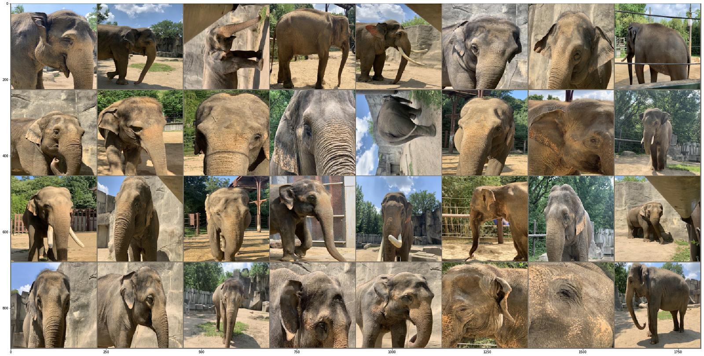

# Asian elephant facial recognition

Repository currently contains baseline models implemented using

Pretrained models - densenet and resnet 
Binary classification model - to understand the quality of images of whether there is an elephant in the image or no.

Experiments:

1. Pretrained Resent and Densenet using weighted cross entropy
2. Pretrained Resent and Densenet using imbalanced data sampler
3. Pretrained Resent and Densenet using top 5 classes of the elephant images
4. Binary classification model.

## Example to run an experiment:
python3 train.py --batch_size=256 --epochs=2000 --data_path='data/dataset/top5' --output_path='output/output_resnet_sampler_top5_lr_0.0001' --model_path='models/model_resnet_lr_0.0001_sampler_top5' --model_name='resnet' --use_sampler=True --use_top5=True 

## Example images:

